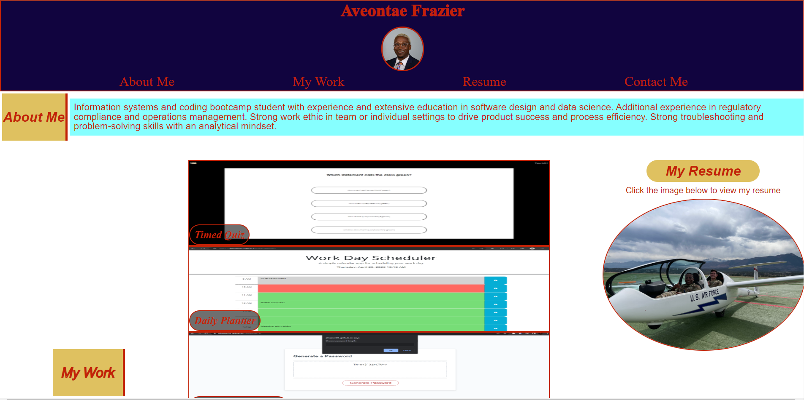

# My Portfolio Website - Challenge 2

## Description

The challenge for this assignment was to create a portfolio webpage to showcase my skills and talents to employers looking to fill a part-time or full-time position. This portfolio highlights my strongest work as well as the thought processes behind it. 

In this project I learned how to practice:
- Flexbox: To make layouts more user friendly and implement responsive web design.
- Media queries: To optimize layouts for different device screen sizes.
- CSS variables: To keep code clean and implement advance CSS styling.

In addition, I continued to practice implementing accessibility elements for those with screen readers or similar accessibility devices with alt attribute.

## Installation

N/A

## Usage

Click [Here](https://afrazier01.github.io/challenge-2/) to go to the deloyed webpage. 

Once the webpage is open, use Chrome DevTools by right-clicking and selecting inspect; or for windows - Control + Shift + I and for MacOS - Command + Option + I. Navigate to the arrow in the top left of the corner of the panel and select it, then hover mouse arrow over images to look at image descriptions. Toggle device emulation to change screen layout and see how the webpage evolves.

Laptop Layout - 

Mobile Layout - 

## Credits

N/A

## License

Please refer to the LICENSE in the repo.

